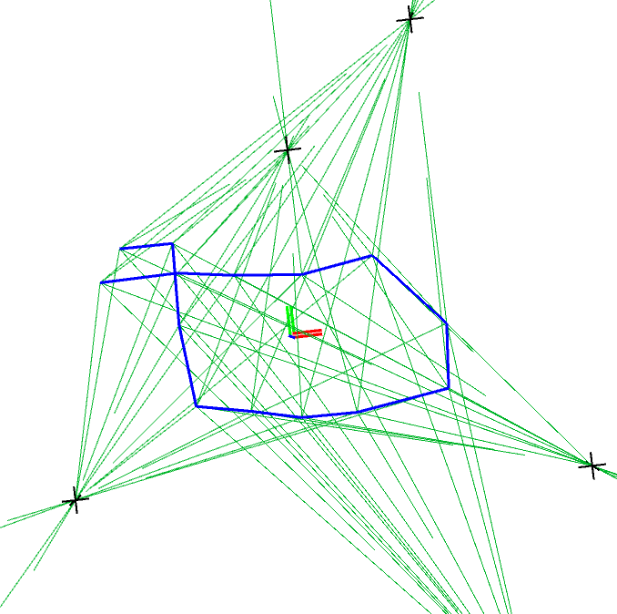

# Rob530_CORA
Last Edited Apr 17, 2026.

UMich ROB530 Project by Samit Mohapatra, Kevin Chang, Nicolas Betancur, and Holden Halucha

This project investigates Range Aided SLAM using RSSI as a proxy for distance, and the CORA framework developed by Dr. Alan Papalia as the estimation back end.

This repository provides a user with tools necessary for authoring CORA legible range aided datasets, as well as firmware for creating your own real world ESP32 RSSI RA-SLAM Experiment!

Repository Contents:

ESP32 Firmware:
-
- PlatformIO project for flashing and running ESP32 devices in a Range Sensing network.
- Features include a client node and up to 5 beacon nodes, all transmitting on different frequency bands.
- Requires PlatformIO extension in VSCode
- The .ini file configures how the hardware is flashed. Make sure to use the correct USB ports for all of the ESP32s.

CORA Solver
-
- C++ library for running CORA on Range Aided SLAM datasets.
- For setup instructions, visit https://github.com/MarineRoboticsGroup/cora
  


RA-Research Library
-
- Simulation tools for authoring Range Aided SLAM datasets.
- Datasets can be generated as RSSI-to-distance with noise injected into the RSSI measurement, or as noisy range data where noise is injected into the range measurement.
- Options are available for data analysis and plotting
  

How to author RA-SLAM datasets with RA-Research:
1. Open world.py
2. Define world size, landmark locations in make_world()
3. Define a trajectory in generate_custom_loop()
4. Open main.py
5. Define experiments and paramter sweeps in main() function

Example main():
This code shows how arguments can be configured and used to run parameter sweeping experiments. In this code, different odometry noise profiles were used to generate pyfactor files that can now be fed to CORA for estimation and smoothing.

Apart from configuration and experimentation, there are dedicated paramter sweep files that output plots of RMSE values along different parameter values.

```python
def main():
    
    ARGS2 = dict(
        sigma_dx=0.005,
        sigma_dy=0.005,
        sigma_dtheta=0.0025,
        sigma_range=0.2,
        A=-55.0,
        n=2.5,
        sigma_rssi=7,
        max_range=50.0,
        measure_every=1,
        dropout_prob=0.0,
        seed=0,
    )
    run_baseline(ARGS2,"range_odom_0_005.pyfg", "rssi_odom_0_005.pyfg",)
    run_experiment_baseline(ARGS2, "hardware_0_005.pyfg")
    ARGS3 = dict(
        sigma_dx=0.01,
        sigma_dy=0.01,
        sigma_dtheta=0.005,
        sigma_range=0.2,
        A=-55.0,
        n=2.5,
        sigma_rssi=7,
        max_range=50.0,
        measure_every=1,
        dropout_prob=0.0,
        seed=0,
    )
    run_baseline(ARGS3, "range_odom_0_01.pyfg", "rssi_odom_0_01.pyfg")
    run_experiment_baseline(ARGS3, "hardware_0_01.pyfg")

    run_rssi_sweep()
    run_range_noise_sweep()
    run_measurement_interval_sweep()


```
